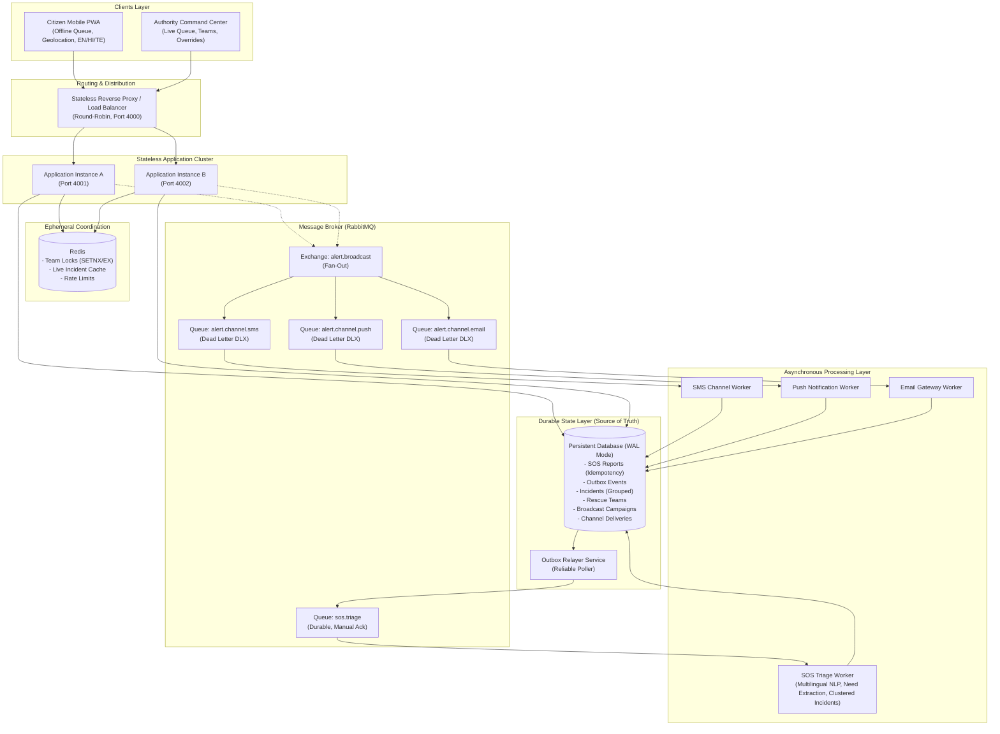

# AlertNet End-to-End Architecture

```mermaid
flowchart TD
    subgraph Clients["Clients Layer"]
        CitizenPWA["Citizen Mobile PWA\n(Offline Queue, Geolocation, EN/HI/TE)"]
        CmdDashboard["Authority Command Center\n(Live Queue, Teams, Overrides)"]
    end

    subgraph LoadBalancer["Routing & Distribution"]
        Proxy["Stateless Reverse Proxy / Load Balancer\n(Round-Robin, Port 4000)"]
    end

    subgraph ApplicationInstances["Stateless Application Cluster"]
        InstanceA["Application Instance A\n(Port 4001)"]
        InstanceB["Application Instance B\n(Port 4002)"]
    end

    subgraph DurableStorage["Durable State Layer (Source of Truth)"]
        Database[("Persistent Database (WAL Mode)\n- SOS Reports (Idempotency)\n- Outbox Events\n- Incidents (Grouped)\n- Rescue Teams\n- Broadcast Campaigns\n- Channel Deliveries")]
        OutboxRelay["Outbox Relayer Service\n(Reliable Poller)"]
    end

    subgraph FastCoordination["Ephemeral Coordination"]
        RedisCluster[("Redis\n- Team Locks (SETNX/EX)\n- Live Incident Cache\n- Rate Limits")]
    end

    subgraph MessageBroker["Message Broker (RabbitMQ)"]
        SOSTriageQ["Queue: sos.triage\n(Durable, Manual Ack)"]
        ExchangeFanout["Exchange: alert.broadcast\n(Fan-Out)"]
        SMSQueue["Queue: alert.channel.sms\n(Dead Letter DLX)"]
        PushQueue["Queue: alert.channel.push\n(Dead Letter DLX)"]
        EmailQueue["Queue: alert.channel.email\n(Dead Letter DLX)"]
    end

    subgraph AsyncWorkers["Asynchronous Processing Layer"]
        TriageWorker["SOS Triage Worker\n(Multilingual NLP, Need Extraction, Clustered Incidents)"]
        SMSWorker["SMS Channel Worker"]
        PushWorker["Push Notification Worker"]
        EmailWorker["Email Gateway Worker"]
    end

    CitizenPWA --> Proxy
    CmdDashboard --> Proxy
    Proxy --> InstanceA
    Proxy --> InstanceB

    InstanceA --> Database
    InstanceB --> Database
    InstanceA --> RedisCluster
    InstanceB --> RedisCluster

    Database --> OutboxRelay
    OutboxRelay --> SOSTriageQ

    InstanceA -.-> ExchangeFanout
    InstanceB -.-> ExchangeFanout

    ExchangeFanout --> SMSQueue
    ExchangeFanout --> PushQueue
    ExchangeFanout --> EmailQueue

    SOSTriageQ --> TriageWorker
    TriageWorker --> Database

    SMSQueue --> SMSWorker
    PushQueue --> PushWorker
    EmailQueue --> EmailWorker

    SMSWorker --> Database
    PushWorker --> Database
    EmailWorker --> Database
```
